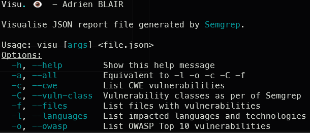
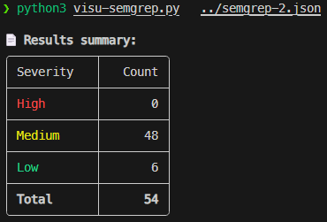
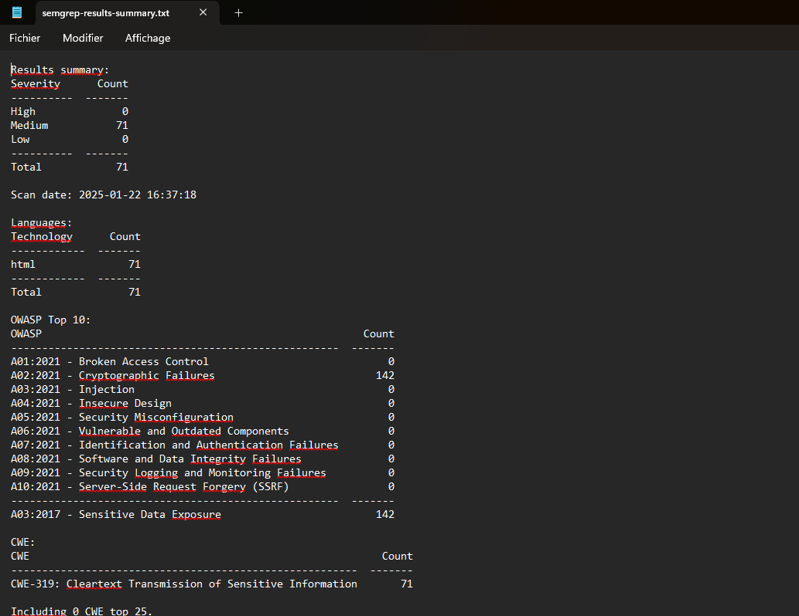
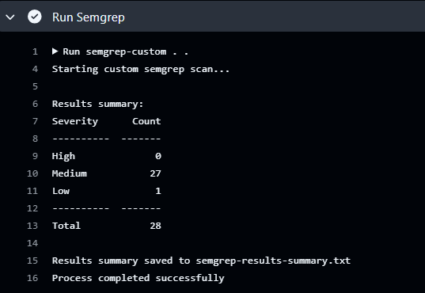

# sast-visu-tools

Set of custom SAST output reports visualisation tools

## 1. visu-semgrep

### 1.1. Description

A tool that reads a semgrep-report json file and displays the results in a more readable way in the CLI.

### 1.2. Usage

```bash
# With the Python script
python3 visu-semgrep.py --all <path_to_semgrep_report.json>
# With the Bash script
./visu-semgrep.sh --all <path_to_semgrep_report.json>
```

> ℹ️ Note: The `-a` or `--all` will execute all the available options. If you want to get a list of the available options, you can use the `-h` or `--help` flag.

#### Available options



### 1.3 Example



## 2. visu-semgrep-ci

### 2.1. Description

A tool that reads a semgrep-report json file and displays the results in a more readable way in the CLI and in a text file. This tool is designed to be used in a CI/CD pipeline.

### 2.2. Usage

```bash
# With the Python script
python3 visu-semgrep-ci.py --all <path_to_semgrep_report.json> <output_file>
# With the Bash script
./visu-semgrep-ci.sh --all <path_to_semgrep_report.json> <output_file>
```

> ℹ️ Note: The `-a` or `--all` will execute all the available options. If you want to get a list of the available options, you can use the `-h` or `--help` flag.

### 2.3. Example output



## 3. semgrep-custom

### 3.1. Description

A custom installation of semgrep that includes a set of custom rules as well as the ***visu-semgrep-ci*** tool. It is designed to be used in a CI/CD pipeline.

### 3.2. Usage

```bash
# With the Python script
python3 semgrep-custom.py <path_to_semgrep_report.json> <output_file>
# With the Bash script
./semgrep-custom.sh <path_to_semgrep_report.json> <output_file>
```

### 3.3. Example

```yaml
# Example with a GitHub Actions workflow file
name: Semgrep OSS scan
on:
    push:
        branches: ["master", "main"]
jobs:
    semgrep:
        name: semgrep-oss-custom/scan
        runs-on: ubuntu-latest
        container:
            image: ahddry/semgrep-custom:latest
        steps:
            - uses: actions/checkout@v4
            - name: Run Semgrep custom scan
              run: semgrep-custom . .
            - name: Upload semgrep artifact
              uses: actions/upload-artifact@v4
              with:
                  name: semgrep-results
                  path: semgrep-report.json
```



## 4. sast-parser

### 4.1. Description

A script that reads a semgrep-report json file or a sarif report file from a SAST tool, parse it as a normalised json file and sends if possible the report to a NoSQL MongoDB database. It is designed to be used in a CI/CD pipeline.

### 4.2. Usage

To use the tool, you need to have a MongoDB database running with a collection named `reports` and another named `projects`.

In your CI/CD environment, you need to set the following environment variables:

- `PROJECT_ID`: The ID of the current project (numeric value)
- `MONGODB_URL`: The URL of the MongoDB database (e.g. `url.example.com:27017`)
- `MONGODB_USERNAME`: The username of the MongoDB database (e.g. `admin`)
- `MONGODB_PASSWORD`: The password of the MongoDB database (e.g. `password`)

**Optional**: Depending on your CI/CD environment, you may need the following environment variables to download the latest version of the script:

- `PARSER_GITHUB_OWNER`: The owner of the repository (e.g. `username`)
- `PARSER_GITHUB_REPO`: The name of the repository (e.g. `repository`)
- `PARSER_GITHUB_TOKEN`: If the repository is private, you need to provide a GitHub token with the `repo` scope

```bash
# With the Python script
python3 sast-parser.py <path_to_report.json|sarif>
```

### 4.3. Example

```yaml
# Example with a GitHub Actions workflow file
name: Appscan Factory SAST
on:
    # Scan changed files in PRs (diff-aware scanning):
    pull_request: {}
    # Scan on-demand through GitHub Actions interface:
    workflow_dispatch: {}
    # Scan mainline branches and report all findings either on a schedule or on push:
    push:
        branches: ["master", "main"]
    schedule:
        - cron: "0 0 */5 * *"
jobs:
    # Perform SAST with Semgrep-OSS:
    SAST:
        name: SAST - Semgrep-OSS
        # If you are self-hosting, change the following `runs-on` value:
        runs-on: ubuntu-latest
        container:
            # A custom Docker image with Semgrep installed.
            image: ahddry/semgrep-custom:latest
        # Skip any PR created by dependabot to avoid permission issues:
        if: (github.actor != 'dependabot[bot]')
        steps:
            # Fetch project source with GitHub Actions Checkout.
            - name: Checkout code
              uses: actions/checkout@v4
            - name: Verify installed tools
              run: |
                  semgrep --version
                  visu-semgrep-ci -t
            - name: Install parser's dependencies
              run: |
                  pip install -r requirements.txt
            - name: Ignore specific files
              run: |
                  echo ".*" > ".semgrepignore"
                  ls -al
            - name: Run Semgrep
              run: semgrep-custom . .
            - name: Upload semgrep artifact
              uses: actions/upload-artifact@v4
              with:
                  name: semgrep-results
                  path: semgrep-report.json
            - name: Upload report summary
              uses: actions/upload-artifact@v4
              with:
                  name: report-summary
                  path: semgrep-results-summary.txt
    # Parse and upload SAST results to database:
    SAST-upload:
        name: Parse and upload SAST results
        runs-on: ubuntu-latest
        needs: SAST
        if: (github.actor != 'dependabot[bot]')
        steps:
            - name: Download semgrep artifact
              uses: actions/download-artifact@v4.1.8
              with:
                  name: semgrep-results
            - name: Setup Python
              uses: actions/setup-python@v4
              with:
                  python-version: "3.x"
            # Step to get the latest release version of the parser
            - name: Get latest release
              id: get_release
              uses: pozetroninc/github-action-get-latest-release@master
              with:
                  owner: ${{ secrets.PARSER_GITHUB_OWNER }}
                  repo: ${{ secrets.PARSER_GITHUB_REPO }}
            - name: Download and install parser
              run: wget https://github.com/${{secrets.PARSER_GITHUB_OWNER}}/${{ secrets.PARSER_GITHUB_REPO }}/releases/download/${{ steps.get_release.outputs.release }}/parsers.zip -O parsers.zip && unzip parsers.zip
            - name: Install dependencies
              run: pip install -r requirements.txt
            - name: Parse results and upload to database
              env:
                  PROJECT_ID: ${{ secrets.PROJECT_ID }}
                  MONGODB_URL: ${{ secrets.MONGODB_URL }}
                  MONGODB_USERNAME: ${{ secrets.MONGODB_USERNAME }}
                  MONGODB_PASSWORD: ${{ secrets.MONGODB_PASSWORD }}
              run: python sast-parser.py semgrep-report.json
            - name: Upload parsed report
              uses: actions/upload-artifact@v4
              with:
                  name: parsed-report
                  path: parsed_file.json
```

## 5. sbom-parser

### 5.1. Description

A script that reads a sbom file and/or an SCA report file from **Depscan**, and sends if possible the report to a NoSQL MongoDB database. It is designed to be used in a CI/CD pipeline.

### 5.2. Usage

To use the tool, you need to have a MongoDB database running with a collection named `sca` and another named `projects`.

In your CI/CD environment, you need to set the following environment variables:

- `PROJECT_ID`: The ID of the current project (numeric value)
- `MONGODB_URL`: The URL of the MongoDB database (e.g. `url.example.com:27017`)
- `MONGODB_USERNAME`: The username of the MongoDB database (e.g. `admin`)
- `MONGODB_PASSWORD`: The password of the MongoDB database (e.g. `password`)

**Optional**: Depending on your CI/CD environment, you may need the following environment variables to download the latest version of the script:

- `PARSER_GITHUB_OWNER`: The owner of the repository (e.g. `username`)
- `PARSER_GITHUB_REPO`: The name of the repository (e.g. `repository`)
- `PARSER_GITHUB_TOKEN`: If the repository is private, you need to provide a GitHub token with the `repo` scope

```bash
# With the Python script
python3 sbom-parser.py <path_to_sbom.json> <path_to_sca.json>
```

### 5.3. Example

```yaml
# Example with a GitHub Actions workflow file
name: Appscan Factory SBOM-SCA
on:
    # Scan changed files in PRs (diff-aware scanning):
    pull_request: {}
    # Scan on-demand through GitHub Actions interface:
    workflow_dispatch: {}
    # Scan mainline branches and report all findings either on a schedule or on push:
    push:
        branches: ["master", "main"]
    schedule:
        - cron: "0 0 */5 * *"
jobs:
    # Perform SBOM generation and SCA audit with CycloneDX and Depscan:
    SBOM-SCA:
        name: SBOM - CycloneDX & SCA - Depscan
        runs-on: ubuntu-latest
        if: (github.actor != 'dependabot[bot]')

        steps:
            - name: Checkout code
              uses: actions/checkout@v4
            - name: Setup Python
              uses: actions/setup-python@v4
              with:
                  python-version: "3.x"
            - name: Setup Node.js
              uses: actions/setup-node@v4
            - name: Install cdxgen
              run: npm install -g @cyclonedx/cdxgen
            - name: Install depscan
              run: pip install owasp-depscan
            - name: Verify installed tools
              run: |
                  cdxgen -v
                  depscan --version
            - name: Run CycloneDx
              run: cdxgen -o cdxgen-sbom.json
            - name: Run depscan
              run: depscan --no-vuln-table --no-banner --bom cdxgen-sbom.json --reports-dir .
            - name: Upload CycloneDx SBOM
              uses: actions/upload-artifact@v4
              with:
                  name: cdxgen-sbom
                  path: cdxgen-sbom.json
            - name: Upload depscan report
              uses: actions/upload-artifact@v4
              with:
                  name: depscan-report
                  path: depscan-bom.json
    # Parse and upload SBOM & SCA results to database:
    SBOM-upload:
        name: Parse and upload SBOM results
        runs-on: ubuntu-latest
        needs: SBOM-SCA
        if: (github.actor != 'dependabot[bot]')

        steps:
            - name: Download SBOM artifact
              uses: actions/download-artifact@v4.1.8
              with:
                  name: cdxgen-sbom
            - name: Download depscan artifact
              uses: actions/download-artifact@v4.1.8
              with:
                  name: depscan-report
            - name: Setup Python
              uses: actions/setup-python@v4
              with:
                  python-version: "3.x"
            # Step to get the latest release version of the parser
            - name: Get latest release
              id: get_release
              uses: pozetroninc/github-action-get-latest-release@master
              with:
                  owner: ${{ secrets.PARSER_GITHUB_OWNER }}
                  repo: ${{ secrets.PARSER_GITHUB_REPO }}
            - name: Download and install parser
              run: wget https://github.com/${{secrets.PARSER_GITHUB_OWNER}}/${{ secrets.PARSER_GITHUB_REPO }}/releases/download/${{ steps.get_release.outputs.release }}/parsers.zip -O parsers.zip && unzip parsers.zip
            - name: Install dependencies
              run: pip install -r requirements.txt
            - name: Parse results and upload to database
              env:
                  PROJECT_ID: ${{ secrets.PROJECT_ID }}
                  MONGODB_URL: ${{ secrets.MONGODB_URL }}
                  MONGODB_USERNAME: ${{ secrets.MONGODB_USERNAME }}
                  MONGODB_PASSWORD: ${{ secrets.MONGODB_PASSWORD }}
              run: python sbom-parser.py cdxgen-sbom.json depscan-bom.json
```

ℹ️ Note: Both the `sast-parser` and `sbom-parser` scripts can be used in the same CI/CD pipeline.
